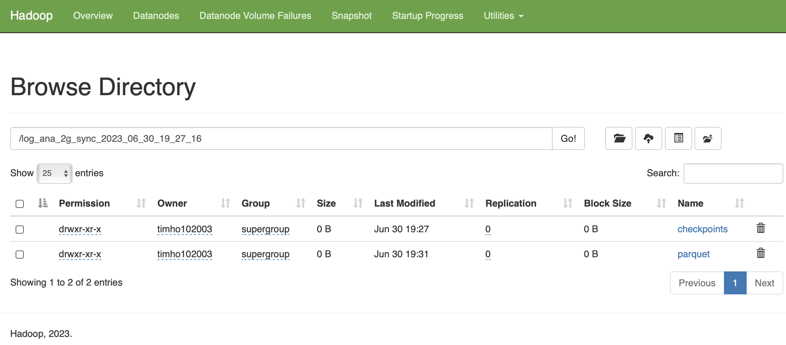
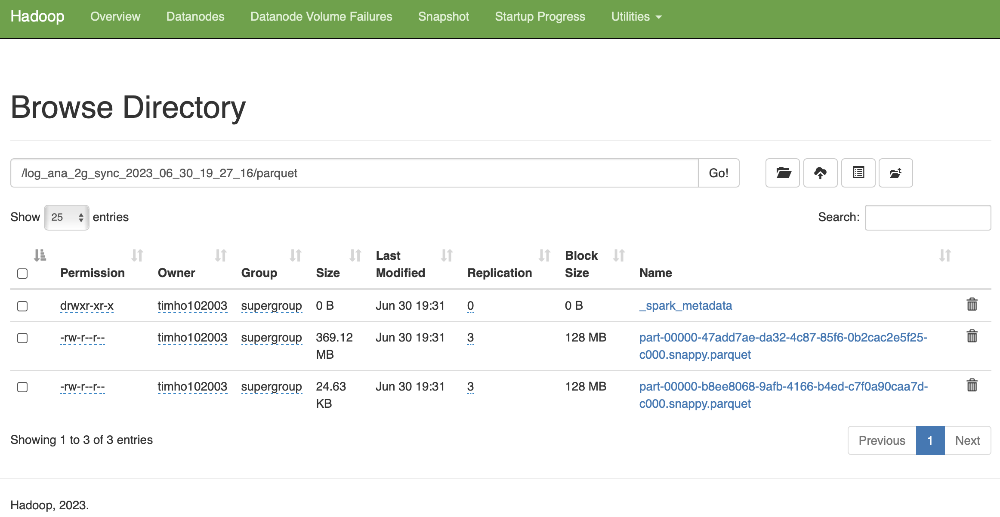

# Log Analysis using Kafka / Hadoop / Spark Streaming
## Goal:
The goal of this application is to ingest a large log file into a Kafka producer using the `confluent_kafka` Python library, process the ingested data with Spark Streaming, and perform data wrangling operations on the streamed data. 
The final goal is to analyze the large log file for:
- Find the most used endpoint of each day of week (Monday to Sunday)
- Calculate the 404 count in each day of week

The large log file is read in batches. Each batch consists of `1000 lines` of log content by default, which are joined together using the '||' symbol before being sent to the Kafka producer. Once the data is ingested, Spark Streaming is used to read the data from the Kafka producer and check the update for every `10 secs`. The batched content is then split back into individual lines. Using regular expressions, the application extracts specific fields from each log line, such as the host, timestamp, method, endpoint, protocol, status, and content size. The application also adds a 'day_of_week' field to the data. The final output is a structured DataFrame and stored in the `HDFS` folder, which can be used for further analysis. This application is designed to handle large log files efficiently and provides a robust solution for log data ingestion, streaming, and processing.

## System:
- MacOS Ventura Version 13.0.1
- Chip: Apple M1 Pro
- Memory: 16GB
  
## Start Kafka/Zookeeper and Hadoop Service:
```bash
brew services start zookeeper # start zookeeper
brew services start kafka # start kafka
start-all.sh # start hadoop namednode, datanode
```

## Steps for Kafka producer and Spark Streaming:
Step 1. To start ingesting the log contents, set up the logfile, batchsize(default: 1000) and producer topic.
```bash
python producer.py --file <log_filename> --batch <batchsize> --log_file <log_filepath> --topic <producer_topic>
```
Arguments for `producer.py`:  
1. --file (`required`): Dataset file path
2. --batch (default: 1000): number of rows per batch
3. --log_file (default: None):  default won't save a log file, specify a log filename to save log
4. --broker (default: 127.0.0.1:9092): kafka producer broker
5. --topic (default: logs_ana_topic): kafka producer topic
   
Step2. To start streaming, set up 
```bash
python consumer.py --topic <producer_topic> --save_dir <save_directory> --hdfs --log_file <log_filepath>
```
Arguments for `consumer.py`:  
1. --topic (`required`): kafka consumer topic, please register the same topic name as the producer
2. --pyspark_package (default: org.apache.spark:spark-sql-kafka-0-10_2.12:3.4.1): Please modify to fit your spark and scala version
3. --save_dir (default: log_analysis): directory to save files
4. --hdfs (default: True): save files to hdfs or local directory
5. --hdfs_url (default: hdfs://localhost:9000): hdfs local url
6. --log_file (default: None): default won't save a log file, specify a log filename to save log
7. --broker (default: 127.0.0.1:9092): kafka consumer broker
8. --group_id (default: None): kafka consumer group id

Step3. Check the output csv files and logs(if you set the --log_file) in the output folder
Step4. Check the saved parquet using hadoop webUI (http://localhost:9870):  

  
  


## Results (from a 2GB .log file with `14117646` rows):
1. Find the most used endpoint of each day of week (Monday to Sunday)  
   
|     | endpoints                                                                         | count |
|-----|-----------------------------------------------------------------------------------|-------|
| Sun | /Archives/edgar/data/0001267332/000117494721000300/form10k-25692_indexpl20031.htm | 13739 |
| Mon | /Archives/edgar/data/0000004281/000119312517062657/R99.htm                        | 13677 |
| Tue | /Archives/edgar/data/0001135856/000113585616000445/xslFormDX01/primary_doc.xml    | 13753 |
| Wed | /Archives/edgar/data/0001852440/000000000022002912/filename2.txt                  | 13697 |
| Thu | /Archives/edgar/data/0001260125/000114420419015071/tv516461_10k.htm               | 13722 |
| Fri | /Archives/edgar/data/0001491487/000114420415051928/0001144204-15-051928.txt       | 13763 |
| Sat | /Archives/edgar/data/0001260125/000114420419015062/tv516457_10k.htm               | 13712 |

2.  Calculate the 404 count in each day of week  

| day of week | count  |
|-------------|--------|
| Sun         | 288267 |
| Mon         | 288047 |
| Thu         | 289487 |
| Sat         | 288592 |
| Wed         | 288684 |
| Fri         | 288678 |
| Tue         | 287896 |